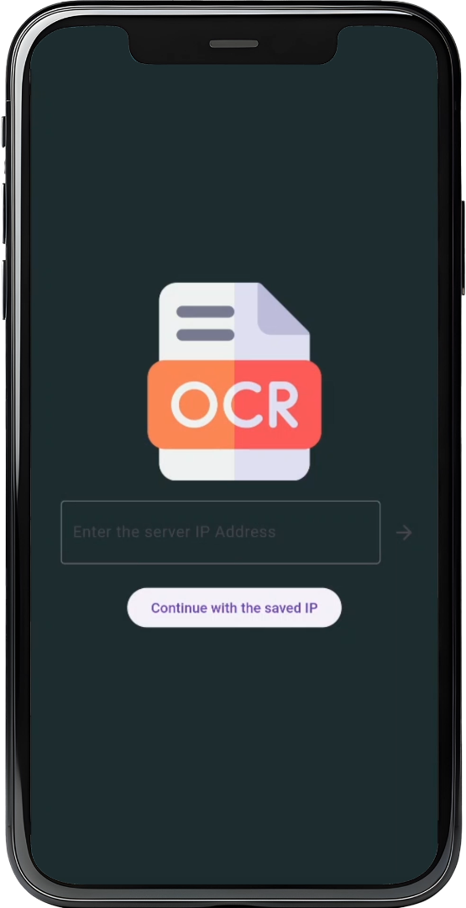
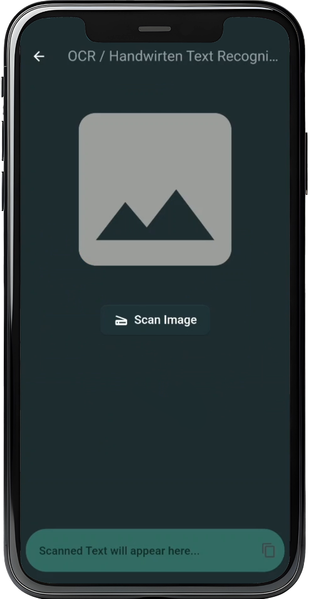
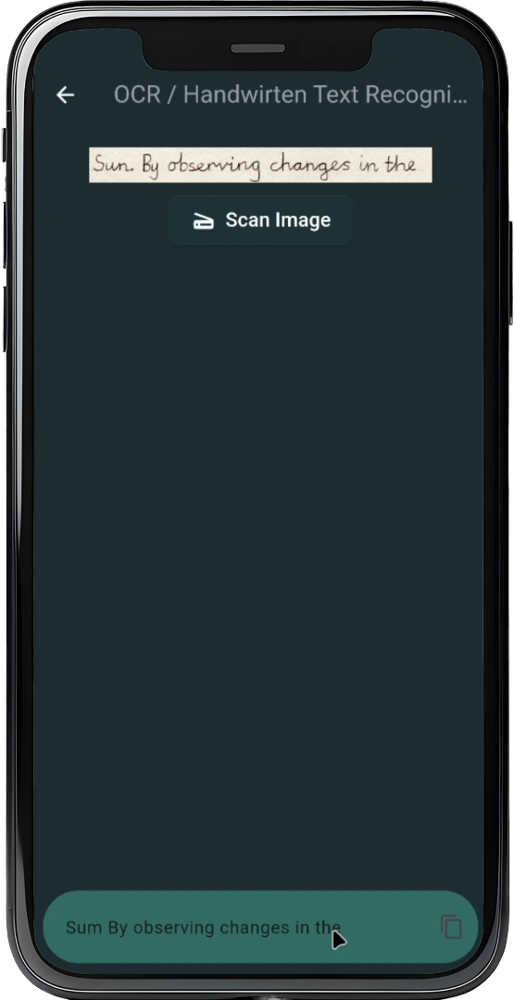

# 📸 OCR Text Detection App

This project is an OCR (Optical Character Recognition) application that allows users to take a photo from the camera or gallery, detect words in the image, and display the text. The detected text can be copied to the clipboard.

## ✨ Features

- 📷 Take a photo using the camera or select an image from the gallery
- 🔍 Detect words in the image
- 📝 Display the detected text
- 📋 Copy the detected text to the clipboard
<br/>

## 🛠️ Technologies Used

- 🐦 **Flutter** for the mobile application
- 🌐 **Flask** as the REST API server
<br/>

## 📸Screenshots


<p align="center">
  
  
  
</p>

<br/>


## 🚀 Getting Started

### Prerequisites

- 🔧 Flutter SDK
- 🐍 Python 3.7.12
- 📦 pip (Python package installer)

### Flutter App Setup

1. Clone the repository:

    ```bash
    git clone https://github.com/Loai-Houmane/OCR.git
    cd OCR/ocr-app
    ```

2. **Install Flutter dependencies:**

    ```bash
    flutter pub get
    ```

3. **Run the Flutter app:**

    ```bash
    flutter run
    ```

### Server Setup

1. **Navigate to the server directory:**

    ```bash
    cd ../../Server-AI
    ```

2. **Create a virtual environment and activate it:**

    ```bash
    python3 -m venv venv
    source venv/bin/activate  # On Windows, use `venv\Scripts\activate`
    ```

3. **Install the required packages:**

    ```bash
    pip install -r requirements.txt
    ```

4. **Run the Flask server:**

    ```bash
    cd src
    python flask_server.py
    ```
<br/>

## 📱 Usage

1. Start the Flask server by following the steps in the Server Setup section.
2. Run the Flutter app on your desired device or emulator.
3. Use the app to take a photo or select an image from the gallery.
4. The app will detect words in the image and display the text.
5. You can copy the detected text to the clipboard.

## 🤝 Contributing

Contributions are welcome! Please feel free to submit a pull request or open an issue.

## 📜 License

This project is licensed under the MIT License - see the [LICENSE](LICENSE) file for details.
